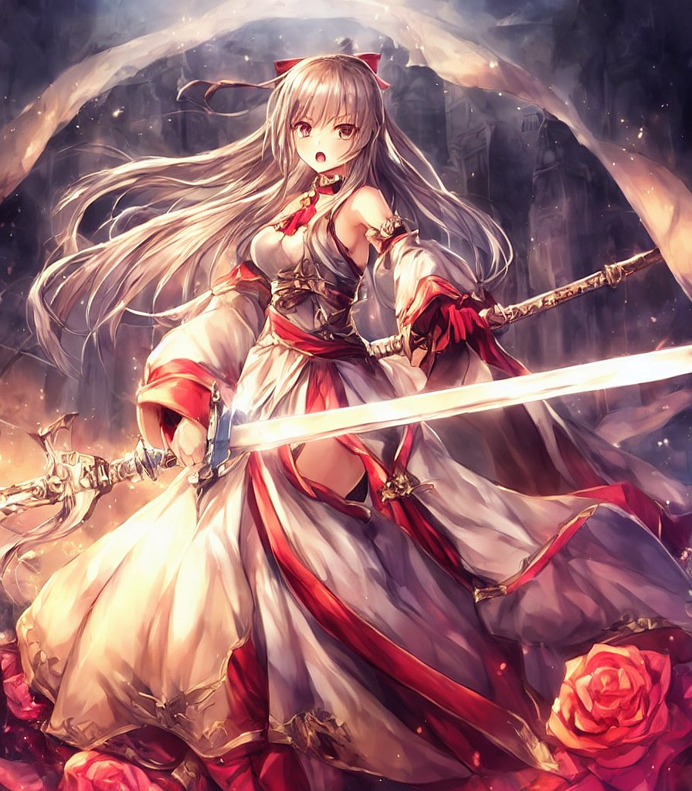
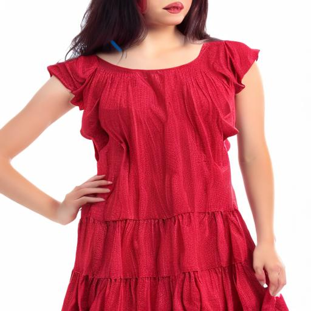

## Awesome-Tuned-Text2Img-Diffusion

## Papers:

- Textual Inversion: An Image is Worth One Word: Personalizing Text-to-Image Generation using Textual Inversion (**ICLR 2023**) [[paper](https://arxiv.org/abs/2208.01618)] [[code](https://github.com/rinongal/textual_inversion)]

- DreamBooth: Fine Tuning Text-to-Image Diffusion Models for Subject-Driven Generation (**arXiv 2022**) [[paper](https://arxiv.org/abs/2208.12242)] [[code](https://github.com/XavierXiao/Dreambooth-Stable-Diffusion)]

- Multi-Concept Customization of Text-to-Image Diffusion (**arXiv 2022**)  [[paper](https://arxiv.org/abs/2212.04488)] [[code](https://github.com/adobe-research/custom-diffusion)]

- Lora: Low-rank adaption of large language model (**arXiv 2021**) [[paper](https://arxiv.org/abs/2106.09685)] [[code](Low-rank Adaptation for Fast Text-to-Image Diffusion Fine-tuning)]

- DreamArtist: Towards Controllable One-Shot Text-to-Image Generation via Contrastive Prompt-Tuning  (**arXiv 2022**) [[paper](https://arxiv.org/abs/2211.11337)] [[code](https://github.com/7eu7d7/DreamArtist-stable-diffusion)]

- Pivotal Tuning for Latent-based Editing of Real Images (**ACM TOG 2022**) [[paper](https://arxiv.org/abs/2106.05744)] [[code](https://github.com/danielroich/PTI)]

## Projects:

|      Project       |                             URL                              |                         Description                          | Example                                                      |
| :----------------: | :----------------------------------------------------------: | :----------------------------------------------------------: | ------------------------------------------------------------ |
|       Future       | [nitrosocke/Future-Diffusion · Hugging Face](https://huggingface.co/nitrosocke/Future-Diffusion) |    High quality 3D images with a futuristic Sci-Fi theme     |  |
|     Paper-Cut      | [Fictiverse/Stable_Diffusion_PaperCut_Model · Hugging Face](https://huggingface.co/Fictiverse/Stable_Diffusion_PaperCut_Model) |                          Paper Cut                           |  |
|       Taiyi        | [IDEA-CCNL/Taiyi-Stable-Diffusion-1B-Anime-Chinese-v0.1 · Hugging Face](https://huggingface.co/IDEA-CCNL/Taiyi-Stable-Diffusion-1B-Anime-Chinese-v0.1) | 中文Stable Diffusion动漫模型，基于100万筛选过的动漫中文图文对训练 |  |
|     BalloonArt     | [Fictiverse/Stable_Diffusion_BalloonArt_Model · Hugging Face](https://huggingface.co/Fictiverse/Stable_Diffusion_BalloonArt_Model) |                    Twisted Balloon images                    |  |
|      Redshift      | [nitrosocke/redshift-diffusion · Hugging Face](https://huggingface.co/nitrosocke/redshift-diffusion) |                  High resolution 3D artwork                  |  |
|        LOGO        | [nicky007/stable-diffusion-logo-fine-tuned · Hugging Face](https://huggingface.co/nicky007/stable-diffusion-logo-fine-tuned) |                             Logo                             |                                                              |
|        Epic        | [johnslegers/epic-diffusion · Hugging Face](https://huggingface.co/johnslegers/epic-diffusion) | High quality output in a wide range of different styles, with support for NFSW content. |                   |
|  TrinArt Derrida   | [naclbit/trinart_derrida_characters_v2_stable_diffusion · Hugging Face](https://huggingface.co/naclbit/trinart_derrida_characters_v2_stable_diffusion) | Roughly 19.2M anime/manga style images plus final finetuning by about 50,000 images |                                  |
|       Nitro        | [nitrosocke/Nitro-Diffusion · Hugging Face](https://huggingface.co/nitrosocke/Nitro-Diffusion) | Trained on three art styles simultaneously while keeping each style separate from the others |  |
|  Cyberpunk-Anime   | [DGSpitzer/Cyberpunk-Anime-Diffusion · Hugging Face](https://huggingface.co/DGSpitzer/Cyberpunk-Anime-Diffusion) |                       Cyberpunk Anime                        |  |
|       Analog       | [wavymulder/Analog-Diffusion · Hugging Face](https://huggingface.co/wavymulder/Analog-Diffusion) | a dreambooth model trained on a diverse set of analog photographs |  |
|    Anime-Pencil    | [yehiaserag/anime-pencil-diffusion · Hugging Face](https://huggingface.co/yehiaserag/anime-pencil-diffusion) |              anime pencil concept drawing style              |  |
|    GTA5_Artwork    | [ItsJayQz/GTA5_Artwork_Diffusion · Hugging Face](https://huggingface.co/ItsJayQz/GTA5_Artwork_Diffusion) |                          GTA5-style                          |  |
|       Funko        | [prompthero/funko-diffusion · Hugging Face](https://huggingface.co/prompthero/funko-diffusion) |                   fine tuned on Funko Pop                    |  |
|    Openjourney     | [prompthero/openjourney · Hugging Face](https://huggingface.co/prompthero/openjourney) |    Stable Diffusion fine tuned model on Midjourney images    |  |
|      Pokeman       | [justinpinkney/pokemon-stable-diffusion · Hugging Face](https://huggingface.co/justinpinkney/pokemon-stable-diffusion) | Stable Diffusion fine tuned on Pokémon by [Lambda Labs](https://lambdalabs.com/) |  |
|    Cats-Musical    | [dallinmackay/Cats-Musical-diffusion · Hugging Face](https://huggingface.co/dallinmackay/Cats-Musical-diffusion) |     trained on screenshots from the film **Cats (2019)**     |  |
|  JWST-Deep-Space   | [dallinmackay/JWST-Deep-Space-diffusion · Hugging Face](https://huggingface.co/dallinmackay/JWST-Deep-Space-diffusion) | trained on images taken by the **James Webb Space Telescope**, as well as Judy Schmidt |  |
| Pai-diffusion-poem | [alibaba-pai/pai-diffusion-poem-large-zh · Hugging Face](https://huggingface.co/alibaba-pai/pai-diffusion-poem-large-zh) | 中文 Lattent Diffusion 模型，为中文古诗词生成精美配图 [paint4poem](https://github.com/paint4poem/paint4poem) |  |
|       Emoji        | [valhalla/emoji-diffusion · Hugging Face](https://huggingface.co/valhalla/emoji-diffusion) | Stable diffusion model fine-tuned on the [russian-emoji dataset](https://www.kaggle.com/datasets/shonenkov/russian-emoji) |  |
|      Van Gogh      | [dallinmackay/Van-Gogh-diffusion · Hugging Face](https://huggingface.co/dallinmackay/Van-Gogh-diffusion) |   trained on screenshots from the film **Loving Vincent**    |  |
|        Robo        | [nousr/robo-diffusion-2-base · Hugging Face](https://huggingface.co/nousr/robo-diffusion-2-base) | A dreambooth-method finetune of stable diffusion that will output cool looking robots when prompted. |  |
|      fashion       | [MohamedRashad/diffusion_fashion · Hugging Face](https://huggingface.co/MohamedRashad/diffusion_fashion) | Stable Diffusion fine-tuned for [Fashion Product Images Dataset](https://www.kaggle.com/datasets/paramaggarwal/fashion-product-images-dataset) |                                  |
|    Counterfeit     | [gsdf/Counterfeit-V2.5 · Hugging Face](https://huggingface.co/gsdf/Counterfeit-V2.5) |             anime style Stable Diffusion model.              |  |

